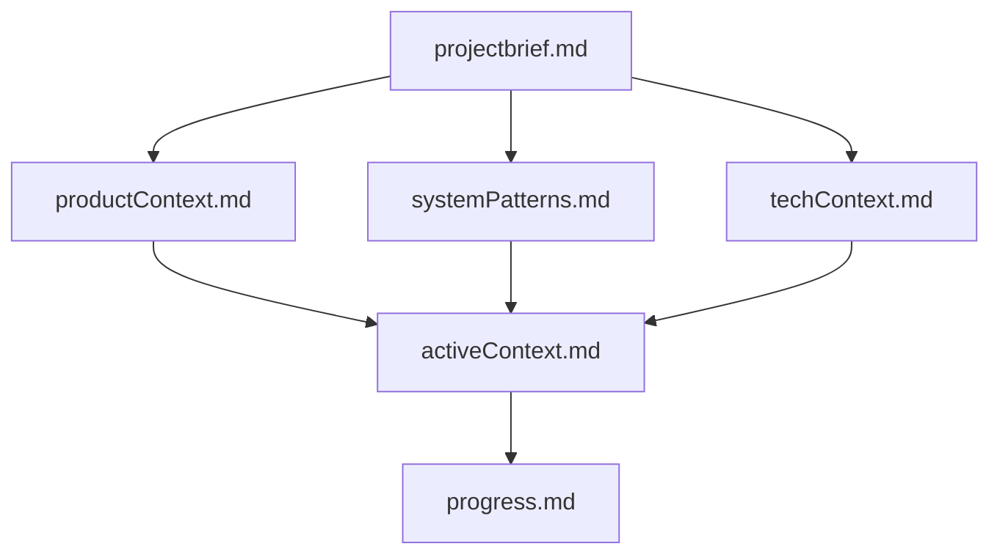

# MessageAI - International Communicator - Memory Bank

**Last Updated:** October 25, 2025  
**Project Status:** ✅ **ALL AI FEATURES COMPLETE** (8/8 PRs, 100%)

---

## About This Memory Bank

This Memory Bank serves as the complete knowledge base for the MessageAI International Communicator project. Since AI context resets between sessions, these documents ensure continuity and provide all necessary context to resume work at any time.

**MessageAI** is now a fully-functional international messaging app with 14 AI-powered features including real-time translation, cultural context, smart replies, image OCR, pronunciation guide, and more.

---

## Core Files (Read These First)

### 1. [projectbrief.md](./projectbrief.md)
**Purpose:** Foundation document that defines the project  
**Contains:**
- Project vision and philosophy
- Success criteria
- Scope boundaries (in/out)
- Key constraints
- Primary user stories
- Technical foundation

**Read this first** - It shapes all other documents.

---

### 2. [productContext.md](./productContext.md)
**Purpose:** Why this project exists and how it should work  
**Contains:**
- Problems we're solving
- User experience flow
- Performance targets
- Design principles
- Key metrics

**Read this** to understand the "why" behind decisions.

---

### 3. [activeContext.md](./activeContext.md) ⚡ **UPDATE FREQUENTLY**
**Purpose:** Current work focus and recent changes  
**Contains:**
- Current phase and progress
- What we just completed
- Active work focus
- Recent decisions
- Known challenges
- Next actions

**Read this** at the start of every session.  
**Update this** after significant milestones.

---

### 4. [systemPatterns.md](./systemPatterns.md)
**Purpose:** Architecture and technical patterns  
**Contains:**
- Architecture overview
- Key technical decisions
- Design patterns in use
- Component relationships
- Data flows
- Security patterns

**Read this** before implementing new features.

---

### 5. [techContext.md](./techContext.md)
**Purpose:** Technologies and development setup  
**Contains:**
- Complete tech stack
- Development setup instructions
- Database schema
- Dependencies
- Environment variables
- Build & deployment

**Read this** when setting up or troubleshooting.

---

### 6. [progress.md](./progress.md) ⚡ **UPDATE FREQUENTLY**
**Purpose:** What works and what's left to build  
**Contains:**
- Overall progress percentage
- Completed PRs
- Remaining work
- Testing status
- Known issues
- Blockers

**Read this** to understand current status.  
**Update this** after completing each PR.

---

## Project Intelligence (.cursor/rules/)

The `.cursor/rules/` directory contains rule files that capture project-specific patterns and best practices:

### [base.mdc](../.cursor/rules/base.mdc)
Core project rules, code patterns, naming conventions, and common pitfalls

### [testing.mdc](../.cursor/rules/testing.mdc)
Testing standards, patterns, mocking strategies, and test structure

### [firebase.mdc](../.cursor/rules/firebase.mdc)
Firebase-specific patterns, collections structure, security rules, and performance tips

### [offline-sync.mdc](../.cursor/rules/offline-sync.mdc)
Offline-first architecture, sync logic, queue management, and conflict resolution

---

## How to Use This Memory Bank

### Starting a New Session
1. Read `activeContext.md` - Know where we are
2. Read `progress.md` - Know what's done
3. Review relevant rule files for the feature you're working on
4. Begin work

### During Development
- Reference `systemPatterns.md` for architecture decisions
- Reference `techContext.md` for implementation details
- Reference `.cursor/rules/` for specific patterns
- Keep code consistent with established patterns

### After Completing Work
1. Update `activeContext.md` with what changed
2. Update `progress.md` with completion status
3. Update other files if architecture or patterns changed
4. Document new patterns in `.cursor/rules/` if discovered

### When Stuck
1. Check `systemPatterns.md` for established patterns
2. Check `.cursor/rules/` for specific guidance
3. Check `techContext.md` for technical constraints
4. Review `projectbrief.md` to stay aligned with goals

---

## Memory Bank Hierarchy

**projectbrief.md** is the foundation - all other files reference it.

---

## File Update Frequency

| File | Update Frequency | Trigger |
|------|------------------|---------|
| `projectbrief.md` | Rarely | Scope changes only |
| `productContext.md` | Rarely | UX/product decisions |
| `activeContext.md` | **Frequently** | After each PR or significant work |
| `systemPatterns.md` | Occasionally | New patterns discovered |
| `techContext.md` | Occasionally | Tech stack changes |
| `progress.md` | **Frequently** | After completing each PR |
| `.cursor/rules/*.mdc` | As needed | New patterns or learnings |

---

## Quick Reference

### Project Info
- **Language:** JavaScript (not TypeScript)
- **Platform:** React Native + Expo
- **Backend:** Firebase (Firestore, Auth, Storage, Cloud Functions)
- **AI Backend:** OpenAI GPT-4o-mini + Google Cloud Vision
- **Focus:** International communication with AI-powered features

### Current Phase
- ✅ **ALL AI FEATURES COMPLETE** (8/8 AI PRs, 100% progress)

### AI Features Implemented
1. ✅ **PR #17:** Cloud Functions Backend (8 functions deployed)
2. ✅ **PR #18:** Language Detection & Real-time Translation
3. ✅ **PR #19:** Universal Cultural Context
4. ✅ **PR #20:** Formality Adjustment
5. ✅ **PR #22:** Pronunciation Guide (TTS)
6. ✅ **PR #21:** Context-Aware Smart Replies (RAG + Style Matching)
7. ✅ **PR #23:** Image Text Translation (OCR with Google Vision)
8. ✅ **PR #24:** AI Feature Polish & Error Handling

**🎉 14 AI FEATURES FULLY OPERATIONAL 🎉**

### Test Coverage
- Unit tests for auth, validation, formatters
- Manual testing for all AI features
- Backend middleware with rate limiting & logging

---

## Related Documents

**In Project Root:**
- `messageai-prd.md` - Original Product Requirements Document
- `messageai-task-list.md` - Original MVP task breakdown
- `AI_INTEGRATION_TASK_LIST.md` - ✅ **AI Features Task List (8 PRs COMPLETE)**
- `README.md` - Comprehensive project documentation
- `backend/README.md` - Cloud Functions API documentation

**The Memory Bank consolidates and organizes information from these documents into a more structured, AI-friendly format.**

---

## Version History

| Version | Date | Changes |
|---------|------|---------|
| 1.0 | Oct 20, 2025 | Initial Memory Bank created |
| 2.0 | Oct 21, 2025 | Updated to reflect 40% completion: 6 PRs done, database migration, messaging complete |
| 3.0 | Oct 21, 2025 | Evening update: 11 PRs done (69%), CRITICAL PATH COMPLETE, presence, groups, offline sync all done |
| 4.0 | Oct 23, 2025 | AI Integration: PRs #17-18 complete (Backend + Translation) |
| 5.0 | Oct 24, 2025 | AI Features: PRs #19-22 complete (Cultural Context, Formality, TTS, Smart Replies) |
| 6.0 | Oct 25, 2025 | ✅ **ALL AI FEATURES COMPLETE:** PRs #23-24 done (OCR, Error Handling) - 8/8 AI PRs (100%) |

---

**Remember:** After each session reset, read ALL Memory Bank files before continuing work. They are your only link to previous decisions and progress.

